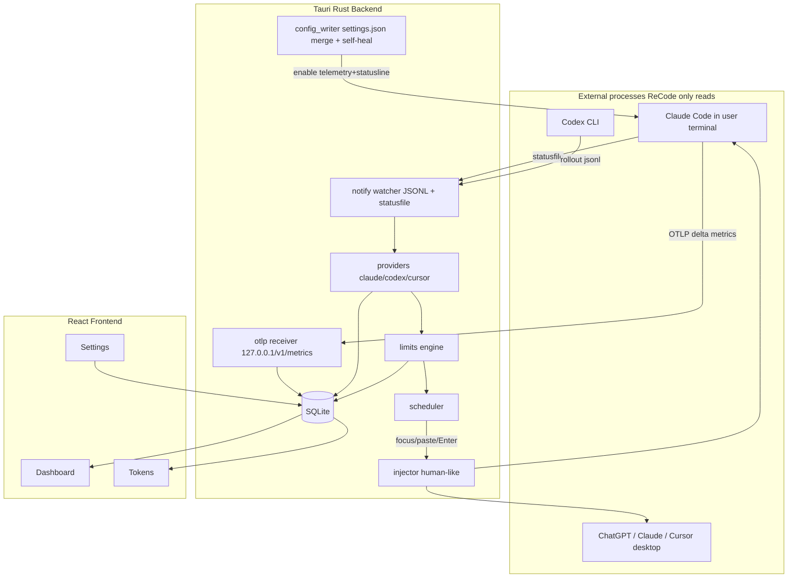

# ReCode — Full Implementation Plan (Handoff Spec)

> Audience: an engineering agent implementing this from scratch. This document is self-contained: it specifies the architecture, exact tech stack, file layout, data model, module-by-module interfaces, key algorithms (with pseudocode), platform-specific details, milestones, and acceptance criteria. Follow it top to bottom.

## 0. Product summary

ReCode is a **cross-platform (Windows + macOS) read-only desktop monitor** for vibe-coding agents (Claude Code, Codex, Cursor, ChatGPT/Claude desktop). It:

1. Displays each tool's **5-hour and 7-day limit** usage % and **reset time**.
2. Tracks **token usage + USD cost** per app and per model.
3. After a limit resets, **sends a customizable "continue" prompt like a human** — focus the target window (a desktop app or a terminal), paste the prompt into the message box, press Enter. Only for sessions where the user enabled auto-continue.
4. **Never launches or hosts the agents.** It reads status from external sessions and injects via OS UI automation.
5. Stores **ALL data locally** (SQLite + JSON). No cloud, no telemetry leaves the machine.

Default continue prompt: `read the history, continue on the work` (editable; per-session override).

### Non-goals
- No embedded terminal / PTY (ReCode does not run agents).
- No sending of any user data off-device.
- No copying of TokenTracker/ccusage source (reuse documented file paths + field names only, original implementation).

## 1. Critical domain knowledge (READ FIRST — determines correctness)

### 1.1 Claude token counts from JSONL are INACCURATE
`~/.claude/projects/**/*.jsonl` `message.usage`:
- `input_tokens`: streaming **placeholder** (0/1 in ~75% of entries), never finalized -> undercounts input 100-174x.
- `output_tokens`: first-chunk placeholder AND **excludes extended-thinking tokens** -> undercounts 10-17x on thinking models. The finalized value lives in the streaming `result` event which is **never written to JSONL** (unrecoverable from files).
- `cache_read_input_tokens`, `cache_creation_input_tokens`: **accurate (~1x)**.

=> Do NOT use JSONL as the primary token source for Claude. Use OpenTelemetry (below). JSONL is used only for history backfill + cache tokens, flagged approximate.

### 1.2 Accurate Claude tokens via native OpenTelemetry
Claude Code emits OTel metrics. Relevant metrics:
- `claude_code.token.usage` (unit `tokens`), attributes: `type` in {`input`,`output`,`cacheRead`,`cacheCreation`}, `model` (e.g. `claude-sonnet-5`), `query_source` in {`main`,`subagent`,`auxiliary`}, plus `effort`, `speed`, `session.id`, `app.version`.
- `claude_code.cost.usage` (unit `USD`), attributes: `model`, `query_source`.

Enable by setting env that Claude reads (either shell env, or `~/.claude/settings.json` `env` block):
```
CLAUDE_CODE_ENABLE_TELEMETRY=1
OTEL_METRICS_EXPORTER=otlp
OTEL_EXPORTER_OTLP_PROTOCOL=http/protobuf
OTEL_EXPORTER_OTLP_ENDPOINT=http://127.0.0.1:<PORT>
OTEL_EXPORTER_OTLP_METRICS_TEMPORALITY_PREFERENCE=delta
OTEL_METRIC_EXPORT_INTERVAL=10000   # 10s, faster feedback
```
For `http/protobuf`, Claude POSTs protobuf `ExportMetricsServiceRequest` to `<ENDPOINT>/v1/metrics`, content-type `application/x-protobuf`. With **delta** temporality each data point is the increment since the last export; ReCode must accumulate.

Note: `rate_limits` (below) only appears for **official Anthropic Pro/Max** accounts. If cc-switch routes Claude to a third-party provider, token metrics still work but rate limits won't be emitted (fall back to manual reset time).

### 1.3 Claude limits + accurate session totals via statusline
Claude Code pipes a JSON object to the configured **statusline command** via stdin on every render. Fields we use:
- `rate_limits.five_hour.used_percentage` (0-100), `rate_limits.five_hour.resets_at` (unix epoch seconds).
- `rate_limits.seven_day.used_percentage`, `rate_limits.seven_day.resets_at`.
- `context_window.total_input_tokens`, `context_window.total_output_tokens` (ACCURATE session cumulative totals; output includes thinking).
- `model.display_name`, `model.id`, `workspace.current_dir`, `session_id`.

`rate_limits` is absent before the first API response and for non-Pro/Max. A window disappears once its `resets_at` passes.

We install a tiny statusline script that appends the received JSON to a file ReCode watches. See §7.3.

### 1.4 Codex token usage + limits (accurate, local)
Files: `~/.codex/sessions/YYYY/MM/DD/rollout-<datetime>-<uuid>.jsonl` (+ `~/.codex/archived_sessions/`). `CODEX_HOME` overrides base. Each line: `{timestamp, type, payload}`.
- `type:"session_meta"` -> `payload.id`, `payload.cwd`, `payload.cli_version`, `payload.model_provider`.
- `type:"turn_context"` -> `payload.model` (model source of truth), `payload.cwd`.
- `type:"event_msg"`, `payload.type:"token_count"` -> `payload.info` with cumulative `last_token_usage` and `total_token_usage`, each: `input_tokens`, `cached_input_tokens`, `cache_creation_input_tokens` (or `cache_write_input_tokens`), `output_tokens`, `reasoning_output_tokens`, `total_tokens`. Recent Codex also embeds a **rate-limit snapshot** here: fields keyed by `limit_window_seconds` (18000 = 5h, 604800 = 7d), `used_percent`, `reset_at` (unix seconds).

Codex totals are **cumulative** and a single rollout can interleave multiple states (parent agent + reviewer). Reconstruct per-turn deltas (algorithm §6.4).

### 1.5 Cursor / ChatGPT-Claude desktop
- Cursor: usage in a local SQLite DB; best-effort read, else manual entry. Token accuracy limited — mark approximate.
- ChatGPT/Claude desktop: no reliable local token/limit file. Support them primarily as **injection targets** (auto-continue). Limits/tokens = manual entry.

### 1.6 Coexistence with cc-switch
cc-switch treats `~/.cc-switch/cc-switch.db` as source of truth and **atomically rewrites `~/.claude/settings.json`** (temp + rename) on every provider switch. Our `env`/`statusLine` additions can be wiped. Mitigation (§6.3): non-destructive merge + self-heal watcher + optional cc-switch "Common Config Snippet" integration.

## 2. Architecture



Data flow principles:
- All writes to SQLite go through `db.rs`. UI never touches files directly; it calls Tauri commands.
- Backend emits Tauri events (`usage_updated`, `limits_updated`, `autocontinue_fired`) so the UI live-updates without polling.

## 3. Tech stack & dependencies

Use latest stable versions (add via package manager; do not pin fabricated versions).

### 3.1 Shell / tooling
- Tauri v2 (`npm create tauri-app@latest` -> React + TypeScript template).
- Node 20+, Rust stable (rustup).

### 3.2 Frontend (`package.json`)
- `react`, `react-dom`, `typescript`, `vite`, `@tauri-apps/api`, `@tauri-apps/plugin-*` as needed.
- `tailwindcss`, `postcss`, `autoprefixer`; shadcn/ui (Radix + `class-variance-authority`, `clsx`, `tailwind-merge`, `lucide-react`).
- `recharts` (charts). `date-fns` (time/countdowns). `zustand` (light client state).

### 3.3 Backend (`src-tauri/Cargo.toml`)
- `tauri` v2, `serde`, `serde_json`, `tokio` (rt-multi-thread, macros, time), `anyhow`, `thiserror`.
- `rusqlite` (features `bundled`) — local SQLite. (Alternative: `sqlx` sqlite; prefer `rusqlite` for simplicity.)
- `notify` — filesystem watcher; `walkdir` — recursive file scan; `glob` optional.
- `chrono` — timestamps.
- OTLP receiver: `axum` + `hyper` (HTTP server) + `prost` + `opentelemetry-proto` (feature `gen-tonic-messages`/prost messages) to decode `ExportMetricsServiceRequest`.
- Input injection: `enigo` (cross-platform keystrokes) + `arboard` (clipboard). Platform extras:
  - macOS: shell out to `osascript` (AppleScript) for reliable app activation + System Events keystrokes; needs Accessibility permission.
  - Windows: `uiautomation` crate and/or `windows` crate (`SendInput`, `SetForegroundWindow`, `FindWindow`).
- `directories` — resolve home/config dirs cross-platform.

## 4. Project structure

```
ReCode/
  IMPLEMENTATION_PLAN.md          # this file
  README.md
  package.json
  index.html
  vite.config.ts
  tailwind.config.js
  tsconfig.json
  src/                            # React frontend
    main.tsx
    App.tsx
    lib/api.ts                    # typed invoke() wrappers + event listeners
    lib/types.ts                  # shared TS types mirroring Rust structs
    store.ts                      # zustand store
    pages/Dashboard.tsx           # limit cards + summary
    pages/Tokens.tsx              # per-app/model tables + charts
    pages/Settings.tsx            # prompts, offset, targets, pricing, telemetry setup
    components/LimitCard.tsx
    components/CountdownBadge.tsx
    components/TokenTable.tsx
    components/UsageChart.tsx
    components/SessionList.tsx
    components/PromptEditor.tsx
    components/TargetPicker.tsx
    components/AccuracyBadge.tsx
    components/ui/*               # shadcn/ui generated components
  src-tauri/
    Cargo.toml
    tauri.conf.json
    build.rs
    resources/
      claude-statusline.js        # bundled statusline hook script (installed to disk)
      pricing-seed.json           # bundled per-model pricing snapshot
    src/
      main.rs                     # Tauri builder, state, event loop wiring
      state.rs                    # AppState (db handle, config, channels)
      db.rs                       # schema, migrations, queries
      models.rs                   # Rust structs (serde) shared with UI
      otlp.rs                     # OTLP HTTP receiver + metric decode + delta accumulate
      config_writer.rs            # settings.json merge/self-heal + cc-switch detection
      watcher.rs                  # notify watcher orchestration + debounce
      providers/
        mod.rs                    # TokenSource trait + registry
        claude.rs                 # OTLP-fed events, statusfile parse, JSONL backfill
        codex.rs                  # rollout parse + delta reconstruction + limits
        cursor.rs                 # sqlite/manual
      limits.rs                   # unified limit model + upsert
      pricing.rs                  # pricing table load/override + cost compute
      scheduler.rs                # per-session timers -> injector
      injector.rs                 # trait + per-OS impls (macos.rs/windows.rs)
      injector_macos.rs
      injector_windows.rs
      commands.rs                 # #[tauri::command] fns exposed to UI
      paths.rs                    # resolve ~/.claude, ~/.codex, ~/.recode, cc-switch
```

## 5. Data model (SQLite)

`db.rs` runs these migrations on startup (create if not exists). All timestamps stored as INTEGER unix seconds (UTC).

```sql
CREATE TABLE IF NOT EXISTS usage_events (
  id            INTEGER PRIMARY KEY AUTOINCREMENT,
  source        TEXT NOT NULL,          -- 'claude' | 'codex' | 'cursor'
  model         TEXT NOT NULL,
  ts            INTEGER NOT NULL,        -- event time (bucketed by day for queries)
  input         INTEGER NOT NULL DEFAULT 0,   -- non-cached input tokens
  output        INTEGER NOT NULL DEFAULT 0,
  cache_read    INTEGER NOT NULL DEFAULT 0,
  cache_write   INTEGER NOT NULL DEFAULT 0,
  reasoning     INTEGER NOT NULL DEFAULT 0,
  cost_usd      REAL    NOT NULL DEFAULT 0,
  session_id    TEXT,
  query_source  TEXT,                    -- 'main'|'subagent'|'auxiliary'|null
  origin        TEXT NOT NULL,           -- 'otlp'|'statusline'|'jsonl' (accuracy marker)
  dedup_key     TEXT UNIQUE              -- prevents double counting
);
CREATE INDEX IF NOT EXISTS idx_usage_ts ON usage_events(ts);
CREATE INDEX IF NOT EXISTS idx_usage_src_model ON usage_events(source, model);

CREATE TABLE IF NOT EXISTS limit_windows (
  source       TEXT NOT NULL,
  window_kind  TEXT NOT NULL,            -- 'five_hour' | 'seven_day'
  used_percent REAL,
  resets_at    INTEGER,                  -- unix seconds; null if unknown
  is_manual    INTEGER NOT NULL DEFAULT 0,
  updated_at   INTEGER NOT NULL,
  PRIMARY KEY (source, window_kind)
);

CREATE TABLE IF NOT EXISTS sessions (
  id                    TEXT PRIMARY KEY,   -- source session id
  source                TEXT NOT NULL,
  cwd                   TEXT,
  model                 TEXT,
  auto_continue_enabled INTEGER NOT NULL DEFAULT 0,
  continue_prompt       TEXT,               -- null => use global default
  target_kind           TEXT,               -- 'desktop_app' | 'terminal'
  target_ref            TEXT,               -- bundle id / window title / handle hint
  last_seen             INTEGER
);

CREATE TABLE IF NOT EXISTS pricing (
  model          TEXT PRIMARY KEY,
  input_pm       REAL NOT NULL,   -- USD per 1M tokens
  output_pm      REAL NOT NULL,
  cache_read_pm  REAL NOT NULL,
  cache_write_pm REAL NOT NULL
);

CREATE TABLE IF NOT EXISTS settings (
  key   TEXT PRIMARY KEY,
  value TEXT NOT NULL
);

CREATE TABLE IF NOT EXISTS autocontinue_log (
  id         INTEGER PRIMARY KEY AUTOINCREMENT,
  session_id TEXT,
  fired_at   INTEGER NOT NULL,
  target     TEXT,
  status     TEXT NOT NULL,   -- 'sent'|'window_not_found'|'no_permission'|'error'
  detail     TEXT
);
```

Default `settings` rows seeded on first run: `default_prompt = "read the history, continue on the work"`, `continue_offset_seconds = 120`, `otlp_port = 0` (0 => auto-pick free port, persist chosen), `telemetry_enabled = "false"`.

## 6. Backend modules — interfaces & algorithms

### 6.1 `paths.rs`
```rust
pub fn home_dir() -> PathBuf;
pub fn claude_dir() -> PathBuf;      // $CLAUDE_CONFIG_DIR or ~/.claude
pub fn claude_settings() -> PathBuf; // <claude_dir>/settings.json
pub fn codex_dir() -> PathBuf;       // $CODEX_HOME or ~/.codex
pub fn recode_dir() -> PathBuf;      // ~/.recode  (create if missing)
pub fn recode_statusfile() -> PathBuf; // ~/.recode/claude-status.jsonl
pub fn ccswitch_db() -> PathBuf;     // ~/.cc-switch/cc-switch.db
```

### 6.2 `otlp.rs` — local OTLP metrics receiver
Runs an `axum` server bound to `127.0.0.1:<port>` with `POST /v1/metrics`.
- Read body bytes; if content-type is `application/x-protobuf`, `prost::Message::decode::<ExportMetricsServiceRequest>`. (Also accept `application/json` OTLP as a fallback.)
- Walk `resource_metrics[].scope_metrics[].metrics[]`. For each metric named `claude_code.token.usage` or `claude_code.cost.usage`, read its `Sum` data points. Each `NumberDataPoint` has `attributes` (Vec<KeyValue>) and value `as_int`/`as_double`, and `time_unix_nano`.
- Extract attributes into a map: `type`, `model`, `query_source`, `session.id`.
- Because temporality is delta, each data point value is already an increment. Convert into a `usage_events` row grouped by (session_id, model, coarse timestamp). Strategy: buffer deltas per (session_id, model, minute bucket) and write/increment a row with a deterministic `dedup_key = format!("otlp:{session}:{model}:{minute}:{type}")` using an UPSERT that adds to the token column.
- Map `type` -> column: `input`->input, `output`->output, `cacheRead`->cache_read, `cacheCreation`->cache_write. For `claude_code.cost.usage`, add to `cost_usd` on the matching row (do NOT recompute cost for otlp-origin rows — Claude's reported cost is authoritative; still keep pricing.rs for tools without cost metrics).
- `origin='otlp'`, `source='claude'`.
- After each batch, emit Tauri event `usage_updated`.

Interface:
```rust
pub struct OtlpServer;
impl OtlpServer {
  pub async fn start(state: AppState) -> anyhow::Result<u16>; // returns bound port
}
```
Port handling: read `settings.otlp_port`; if 0 bind to an ephemeral port, then persist it so the settings.json env stays stable across restarts (prefer a fixed persisted port, e.g. first run picks 41xx and saves it).

### 6.3 `config_writer.rs` — settings.json telemetry + statusline (cc-switch safe)
Responsibilities:
- `ensure_telemetry(port)`: read `claude_settings()` JSON (or `{}`), deep-merge our keys WITHOUT removing existing ones:
  - `env.CLAUDE_CODE_ENABLE_TELEMETRY = "1"`, `env.OTEL_METRICS_EXPORTER="otlp"`, `env.OTEL_EXPORTER_OTLP_PROTOCOL="http/protobuf"`, `env.OTEL_EXPORTER_OTLP_ENDPOINT="http://127.0.0.1:{port}"`, temporality + interval as §1.2.
  - `statusLine = { "type":"command", "command":"<node> <path to installed claude-statusline.js>" }` — but ONLY if the user opted into statusline capture and there is no existing user statusLine we would clobber; if one exists, wrap it (call theirs, then ours) or warn.
- Write atomically (temp file + rename) with a `.recode.bak` backup first.
- `is_present()`: check whether our env keys are still in the file.
- Self-heal: `watcher.rs` watches `claude_settings()`; on change, debounce 1500ms, if `!is_present()` and telemetry is enabled, re-apply. Guard against infinite loops by ignoring our own writes (compare mtime/skip flag).
- cc-switch integration: if `ccswitch_db()` exists, expose a status "cc-switch detected" and a command `register_ccswitch_snippet()` that writes guidance / (optional) inserts our env into cc-switch's Common Config Snippet if a documented mechanism exists; otherwise instruct the user in the UI. Default behavior still self-heals the live file.

```rust
pub fn ensure_telemetry(port: u16, with_statusline: bool) -> anyhow::Result<()>;
pub fn remove_telemetry() -> anyhow::Result<()>;
pub fn telemetry_present() -> bool;
pub fn ccswitch_detected() -> bool;
```

### 6.4 `providers/codex.rs` — token deltas + limits
Discovery: recursively list `codex_dir()/sessions/**/rollout-*.jsonl` and `archived_sessions/`. Track per-file byte offset (in a small state table or in-memory map) so re-parsing only reads appended lines (tailing).

Per-turn delta reconstruction (Codex reports cumulative, streams may interleave):
```
state: LRU<stream_key, PrevTotals> (cap 32)
for each token_count event with info.total_token_usage T and info.last_token_usage L:
    # Identify the stream this belongs to using the invariant: prev_total = T - L
    prev = T - L                      # componentwise
    key = fingerprint(prev)           # match an existing baseline whose stored total == prev
    if key found in state:
        delta = T - state[key]
    else:
        delta = L                     # first observation for this stream => the last-usage IS the delta
    state[key or new] = T
    emit delta (input, cached_input, cache_creation, output, reasoning)
normalize: input = input - cached_input (keep non-cached separate); total recomputed
```
Write `usage_events` with `origin='jsonl'`, `source='codex'`, `model` from the nearest preceding `turn_context.payload.model`, `session_id` from `session_meta.payload.id`, `dedup_key = "codex:{session}:{file}:{line_no}"`.

Cost for codex rows: compute via `pricing.rs` (Codex has no USD metric). Treat reasoning as folded into output (reasoning cost = 0 for source `codex`).

Limits: if a `token_count` event carries the rate-limit snapshot, upsert `limit_windows` for `codex` with `five_hour` (18000) / `seven_day` (604800), `used_percent`, `resets_at=reset_at`. If absent, leave for manual.

### 6.5 `providers/claude.rs`
- Primary token events come from `otlp.rs` (already writes rows). This module handles:
  - `parse_statusfile()`: tail `recode_statusfile()` (appended by the statusline hook). Each line is the statusline JSON. Extract `rate_limits` -> upsert `limit_windows` for `claude`. Extract `context_window.total_input_tokens/total_output_tokens` + `model` -> maintain an accurate per-session cumulative; if OTel is unavailable, synthesize `usage_events` with `origin='statusline'` from the deltas of these cumulative totals (dedup by session + monotonically increasing totals).
  - `backfill_jsonl()`: one-time/history scan of `~/.claude/projects/**/*.jsonl`. Dedup by `requestId` (== `message.id`), keep the **last** chunk (`stop_reason != null`). Only trust `cache_read_input_tokens`/`cache_creation_input_tokens`; store input/output as-is but `origin='jsonl'` so UI badges them approximate. Recurse into `subagents/`; set `query_source` from `isSidechain`.
- Precedence when merging sources for display: prefer `otlp` rows; if a day/model has otlp data, ignore statusline/jsonl duplicates for that day/model (query-time filter by best available `origin`).

### 6.6 `providers/cursor.rs`
- Attempt to open Cursor's local SQLite usage store (read-only, `PRAGMA query_only`). If schema/path unknown or unavailable, expose manual-entry only. Mark `origin='jsonl'`/approximate. Keep this behind a feature flag; do not block v1 on it.

### 6.7 `limits.rs`
```rust
pub struct LimitWindow { pub source:String, pub kind:String, pub used_percent:Option<f64>, pub resets_at:Option<i64>, pub is_manual:bool }
pub fn upsert(win: LimitWindow) -> Result<()>;   // is_manual writes never overwritten by auto unless user clears
pub fn all() -> Result<Vec<LimitWindow>>;
pub fn next_reset(source:&str, kind:&str) -> Option<i64>;
```
Rule: a manual override (`is_manual=1`) is authoritative until the user clears it. Auto updates go to `is_manual=0` rows.

### 6.8 `pricing.rs`
- Load `resources/pricing-seed.json` on first run into `pricing` table; user edits persist. `matcher(model)` resolves nearest pricing (exact, then normalized/lowercased, then family prefix). Unknown -> zeros (cost 0, flagged in UI).
- `compute_cost(row)` = `(input*input_pm + output*output_pm + cache_read*cache_read_pm + cache_write*cache_write_pm)/1e6`. For `origin='otlp'` Claude rows, prefer Claude's reported `cost_usd` and skip recompute.

### 6.9 `scheduler.rs`
- Maintains a `tokio` task per enabled session (or a single task scanning every 15s). For each session with `auto_continue_enabled=1`:
  - Determine the tool's soonest relevant `resets_at` (from `limit_windows` for that source, `five_hour` primarily; user can choose which window).
  - Target fire time = `resets_at + continue_offset_seconds`.
  - When now >= fire time and not already fired for this window (track `last_fired_reset` per session), call `injector.send(target, prompt)`.
  - Resolve `prompt` = session.continue_prompt or global default.
  - Log to `autocontinue_log`; emit `autocontinue_fired` event. On failure (window not found / no permission), do not retry blindly — surface a notification.
- Guardrails: never fire more than once per (session, window resets_at); a global min-interval; a "dry run / notify only" mode from settings.

### 6.10 `injector.rs` (+ `_macos` / `_windows`)
Trait:
```rust
pub struct Target { pub kind: TargetKind, pub reference: String } // desktop_app(bundle id / app name) | terminal(window title)
pub trait Injector { fn send(&self, target:&Target, text:&str) -> Result<InjectOutcome>; fn list_targets(&self) -> Result<Vec<Target>>; }
```
Human-like send = set clipboard to `text` (arboard), focus the target window, paste, press Enter. Implementations:

macOS (`injector_macos.rs`): use `osascript`.
- Activate: `tell application "<AppName>" to activate` (or by bundle id via `System Events`).
- Paste + send: `tell application "System Events" to keystroke "v" using command down` then `key code 36` (Return).
- Requires Accessibility permission for the ReCode app; detect and prompt the user to grant it (open `x-apple.systempreferences:com.apple.preference.security?Privacy_Accessibility`).
- `list_targets`: `tell application "System Events" to get name of every process whose background only is false`.

Windows (`injector_windows.rs`): use `windows`/`uiautomation` crates.
- Find window: `FindWindowW` / enumerate top-level windows and match title/process (ChatGPT, Claude, Cursor, Windows Terminal).
- Focus: `SetForegroundWindow` (+ `ShowWindow(SW_RESTORE)`).
- Paste: set clipboard, then `SendInput` Ctrl+V, then `SendInput` Enter. Or use UI Automation to find the edit control and `ValuePattern`/`SendKeys`.
- No special permission usually, but respect UIPI (don't target elevated windows).

Both: verify the target became foreground before sending; return `InjectOutcome::{Sent, WindowNotFound, NoPermission, Error(String)}`.

### 6.11 `watcher.rs`
- Watch: `codex_dir()/sessions` (recursive), `recode_statusfile()`, `claude_settings()`, and (optional) `~/.claude/projects`.
- Debounce events (e.g. 500ms) per path; on change call the relevant provider's incremental parse (tail from stored offset). For `claude_settings()` run the self-heal check.

### 6.12 `commands.rs` (Tauri commands, all sync-ish, return serde types)
```
get_dashboard() -> { limits: LimitWindow[], summary: {...} }
get_usage(range: {from,to}, group_by: 'app'|'model') -> UsageAggregate[]
get_sessions() -> SessionView[]
set_session_autocontinue(id, enabled, prompt?, target?) -> ()
set_manual_limit(source, kind, resets_at, used_percent?) -> ()
clear_manual_limit(source, kind) -> ()
get_pricing() / set_pricing(model, rates) -> ()
get_settings() / set_setting(key, value) -> ()
enable_telemetry() -> { port } ; disable_telemetry()
telemetry_status() -> { present, ccswitch_detected, port }
list_injection_targets() -> Target[]
test_injection(target, text) -> InjectOutcome     # "Send test message"
open_accessibility_settings() -> ()               # macOS helper
```
Events emitted: `usage_updated`, `limits_updated`, `autocontinue_fired`, `telemetry_status_changed`.

## 7. Frontend spec

### 7.1 Pages
- **Dashboard**: grid of `LimitCard` (one per source with data) showing 5h + 7d used% bars and `CountdownBadge` to `resets_at`; a "today's tokens + cost" summary; recent auto-continue log. Manual-limit editor inline.
- **Tokens**: date-range picker; toggle group-by App / Model; `TokenTable` (columns: app, model, input, output, cache read, cache write, total, cost, accuracy badge) + `UsageChart` (stacked tokens over time; cost line). Accuracy badge from `origin` (otlp = "accurate", statusline = "session totals", jsonl = "approx").
- **Settings**: default prompt + per-session overrides (`SessionList` + `PromptEditor`), continue offset, per-session injection target (`TargetPicker` with "Test send"), pricing table editor, telemetry setup panel (enable/disable, show port, cc-switch notice + guidance), macOS accessibility permission button.

### 7.2 `lib/api.ts`
Typed wrappers over `@tauri-apps/api/core` `invoke` for every command in §6.12, plus `listen` helpers for the events. `lib/types.ts` mirrors Rust `models.rs`.

### 7.3 Bundled `resources/claude-statusline.js`
Reads full stdin, appends one JSON line to `~/.recode/claude-status.jsonl` (create dir), then prints a short human status line to stdout (so the user still gets a normal statusline). Must be dependency-free Node. Pseudocode:
```js
let d=''; process.stdin.on('data',c=>d+=c); process.stdin.on('end',()=>{
  try { const j=JSON.parse(d); appendLine(recodeDir()+'/claude-status.jsonl', JSON.stringify({t:Date.now(), rate_limits:j.rate_limits, context_window:j.context_window, model:j.model, session_id:j.session_id})); }
  catch{}
  const p = j?.rate_limits?.five_hour?.used_percentage; process.stdout.write(p!=null?`5h ${p.toFixed(0)}%`:'');
});
```
Rotate/truncate the file when > ~5MB.

## 8. Milestones & acceptance criteria

Implement in order; each milestone must be runnable and demoable.

- **M1 Scaffold.** Tauri v2 + React + Tailwind + shadcn boots; empty Dashboard/Tokens/Settings routes; `db.rs` creates the SQLite schema and seeds settings on launch.
  - Accept: app launches on Win + macOS; DB file created under app data dir; `get_settings` returns seeded defaults.
- **M2 Codex tokens.** `providers/codex.rs` + `watcher.rs` + `pricing.rs` populate `usage_events`; Tokens page shows per-app/model tokens + cost for Codex, live-updating.
  - Accept: running Codex locally produces rows within a few seconds; delta reconstruction never double-counts across a resumed session (unit test with a fixture rollout).
- **M3 Claude accurate tokens.** `otlp.rs` receiver + `config_writer.enable_telemetry` + `providers/claude.rs` OTLP ingestion. Tokens page shows Claude with `origin=otlp` and accurate counts; `disable_telemetry` cleanly removes keys.
  - Accept: after enabling telemetry and running Claude, `claude_code.token.usage` deltas appear; totals are within ~1-2% of `/usage`/statusbar (NOT the 46x-off JSONL numbers).
- **M4 Limits + reset times.** statusline hook install + `claude-status.jsonl` parse + Codex snapshot + manual override -> `limit_windows`; Dashboard shows 5h/7d cards with live countdowns.
  - Accept: Claude Pro/Max shows real `resets_at`; manual override persists and is authoritative; self-heal re-applies telemetry after a simulated cc-switch overwrite of settings.json.
- **M5 Human-like injection.** `injector` per-OS + `list_injection_targets` + `test_injection`; TargetPicker with a working "Send test message" into a chosen ChatGPT/Claude/terminal window.
  - Accept: test message actually appears and is submitted in the chosen window on both OSes; missing window / missing permission returns a clear outcome, not a crash.
- **M6 Auto-continue scheduler.** `scheduler.rs` fires prompt at `resets_at + offset` for enabled sessions; `autocontinue_log`; notify-only mode.
  - Accept: with a manual near-future reset time, the prompt is sent once at the right time; never double-fires for the same window; failures are logged + surfaced.
- **M7 Polish.** Cursor best-effort source, pricing editor, cc-switch guidance UI, empty/error states, theming, packaging (`.dmg`/`.app` + `.msi`/`.exe`), README.
  - Accept: signed-ish local builds run on both OSes; all data confirmed to remain local (no outbound network except the localhost OTLP loopback).

## 9. Testing strategy
- Rust unit tests with fixture files for: Codex delta reconstruction (interleaved streams, resume), Claude JSONL dedup (last-chunk-wins), OTLP protobuf decode (record a real payload to a fixture), settings.json non-destructive merge + self-heal, pricing matcher, cost math.
- Integration: a mock that POSTs a captured OTLP payload to the receiver and asserts rows.
- Manual test matrix per OS for injection + accessibility permissions.

## 10. Risks & mitigations (carry into implementation)
- OTel only captures going forward; no retro fix. Mitigation: statusline session totals + JSONL history (approx, badged).
- `rate_limits` only for Anthropic Pro/Max; third-party (cc-switch) routes won't emit it -> manual reset entry.
- cc-switch rewrites settings.json -> non-destructive merge + self-heal + snippet integration (§6.3).
- Injection fragility (window must be open; app layout changes; permissions) -> user-selected target, focus verification, notify-on-failure, "Test send" button, notify-only mode.
- Don't clobber a user's existing `statusLine` -> detect and wrap/warn.

## 11. Coding conventions
- Rust: `anyhow::Result` at boundaries, `thiserror` for typed errors; no `unwrap()` in non-test code; all file writes atomic (temp+rename); all SQLite access via `db.rs` behind a `Mutex<Connection>` or a small pool. Comments only for non-obvious intent.
- TS: strict mode; types mirror Rust; no direct fs access; all backend calls via `lib/api.ts`.
- Never send data off-device; the only network socket is the localhost OTLP listener.

## 12. Detailed task breakdown (handoff checklist)

Work top to bottom. Each `[ ]` is a concrete, independently verifiable task. "Test:" lines are the minimum verification. Don't start a milestone's UI before its backend command exists.

### M1 — Scaffold & DB
- [ ] `npm create tauri-app@latest` (React + TS). Confirm `npm run tauri dev` opens a window on this OS.
- [ ] Add Tailwind + PostCSS + `tailwind.config.js`; verify a styled element renders.
- [ ] Init shadcn/ui; generate `button`, `card`, `table`, `input`, `switch`, `tabs`, `badge`, `dialog`, `select`.
- [ ] Add router (or simple tab state via `zustand`) for Dashboard / Tokens / Settings; empty pages.
- [ ] Cargo deps: `rusqlite{bundled}`, `serde`, `serde_json`, `tokio`, `anyhow`, `thiserror`, `chrono`, `directories`, `notify`, `walkdir`.
- [ ] `paths.rs`: implement all path helpers (§6.1); create `~/.recode` if missing.
- [ ] `db.rs`: open SQLite under Tauri app-data dir (`app_handle.path().app_data_dir()`); run all migrations (§5); wrap `Connection` in `Mutex` inside `AppState`.
- [ ] Seed default `settings` rows on first run (default_prompt, continue_offset_seconds=120, otlp_port picked+persisted, telemetry_enabled=false).
- [ ] `models.rs` + `lib/types.ts`: define shared types. `commands.rs`: implement `get_settings` / `set_setting`; wire into `main.rs` `invoke_handler`.
- [ ] `lib/api.ts`: typed `invoke` wrappers; Settings page reads/writes a setting round-trip.
- [ ] Test: launch on Windows AND macOS; DB file exists; settings round-trip works.

### M2 — Codex token tracking
- [ ] `pricing.rs`: bundle `resources/pricing-seed.json` (seed a handful of real Claude + GPT/Codex models); load into `pricing` table on first run; implement `matcher()` + `compute_cost()`.
- [ ] `providers/codex.rs`: recursive discovery of `sessions/**/rollout-*.jsonl` + `archived_sessions/` via `walkdir`.
- [ ] Implement per-file byte-offset tailing (store offsets in an in-memory map keyed by path; optionally persist).
- [ ] Line parser: dispatch on `type` (`session_meta`, `turn_context`, `event_msg`); extract model from latest `turn_context.payload.model`, session id from `session_meta.payload.id`.
- [ ] Implement delta reconstruction (§6.4) with an LRU (cap 32) of stream baselines; `normalizeUsage` (input = input - cached_input; recompute total).
- [ ] Write `usage_events` (origin='codex'/'jsonl', dedup_key `codex:{session}:{file}:{line}`); compute cost (reasoning cost = 0).
- [ ] `watcher.rs`: watch `codex_dir()/sessions` recursively; debounce 500ms; call incremental parse; emit `usage_updated`.
- [ ] `commands.rs`: `get_usage(range, group_by)`, `get_sessions`.
- [ ] Frontend Tokens page: `TokenTable` + `UsageChart` + range picker + group-by toggle; live-update on `usage_updated`.
- [ ] Unit test: fixture rollout with a resumed + interleaved (parent + reviewer) stream asserts NO double counting.
- [ ] Test: run Codex locally -> rows appear within seconds; totals sane.

### M3 — Claude accurate tokens (OTLP)
- [ ] Cargo deps: `axum`, `hyper`, `prost`, `opentelemetry-proto` (prost messages), `bytes`.
- [ ] `otlp.rs`: `axum` server on `127.0.0.1:{persisted_port}`, route `POST /v1/metrics`; decode `application/x-protobuf` into `ExportMetricsServiceRequest` (also accept JSON OTLP).
- [ ] Walk resource/scope/metrics; handle `claude_code.token.usage` (Sum, delta) + `claude_code.cost.usage`; read attributes (`type`,`model`,`query_source`,`session.id`) + value.
- [ ] Map `type`->column; UPSERT into `usage_events` bucketed per (session, model, minute) with dedup_key `otlp:{session}:{model}:{minute}:{type}`, accumulating; origin='otlp'. Add cost.usage to `cost_usd`.
- [ ] Emit `usage_updated` after each batch. Start server from `main.rs`; store bound port in `AppState` + settings.
- [ ] `config_writer.rs`: `ensure_telemetry(port, with_statusline=false)` deep-merges env keys (§1.2) into `~/.claude/settings.json` atomically with `.recode.bak`; `remove_telemetry`; `telemetry_present`.
- [ ] `commands.rs`: `enable_telemetry` (writes env, returns port), `disable_telemetry`, `telemetry_status`.
- [ ] Settings page: telemetry panel (enable/disable, show endpoint/port, status).
- [ ] `providers/claude.rs`: query-time precedence so otlp rows win over statusline/jsonl per day+model. Add `AccuracyBadge` (origin) to Tokens table.
- [ ] Unit test: decode a captured OTLP protobuf fixture -> correct rows.
- [ ] Test: enable telemetry, run Claude, confirm accurate deltas (~1-2% of `/usage`, not 46x off).

### M4 — Limits, reset times, self-heal
- [ ] Bundle `resources/claude-statusline.js` (§7.3); on `enable_statusline`, install it and set `settings.json` `statusLine` (wrap existing if present; else set); write output to `~/.recode/claude-status.jsonl` with size-based rotation.
- [ ] `providers/claude.rs::parse_statusfile`: tail the statusfile; upsert `limit_windows` (claude, five_hour/seven_day from `rate_limits`); if OTLP absent, synthesize origin='statusline' usage from `context_window` cumulative deltas.
- [ ] `providers/codex.rs`: parse embedded rate-limit snapshot (`limit_window_seconds` 18000/604800, `used_percent`, `reset_at`) -> `limit_windows` (codex).
- [ ] `limits.rs`: `upsert` (respect `is_manual`), `all`, `next_reset`. `commands.rs`: `set_manual_limit`, `clear_manual_limit`.
- [ ] Self-heal: `watcher.rs` watches `claude_settings()`; debounce 1500ms; if telemetry enabled and `!telemetry_present()`, re-apply; ignore our own writes (skip-flag/mtime).
- [ ] cc-switch: `config_writer::ccswitch_detected()`; Settings shows a notice + guidance (Common Config Snippet) when `~/.cc-switch/cc-switch.db` exists.
- [ ] Dashboard: `LimitCard` (5h + 7d bars) + `CountdownBadge`; inline manual-limit editor; live-update on `limits_updated`.
- [ ] Test: Pro/Max shows real `resets_at`; manual override persists + wins; simulate a cc-switch overwrite of settings.json -> telemetry block is auto-restored.

### M5 — Human-like injection
- [ ] Cargo deps: `enigo`, `arboard`; macOS: `osascript` via `std::process::Command`; Windows: `windows` (+ optionally `uiautomation`).
- [ ] `injector.rs`: `Target`, `TargetKind`, `Injector` trait, `InjectOutcome`.
- [ ] `injector_macos.rs`: `list_targets` (visible processes); `send` = set clipboard, `activate` app, System Events Cmd+V + Return; detect Accessibility permission; `open_accessibility_settings` command.
- [ ] `injector_windows.rs`: `list_targets` (enumerate top-level windows/titles); `send` = set clipboard, `SetForegroundWindow`(+restore), `SendInput` Ctrl+V + Enter; skip elevated windows.
- [ ] Verify target is foreground before sending; return precise outcome; never panic.
- [ ] `commands.rs`: `list_injection_targets`, `test_injection(target, text)`.
- [ ] Frontend `TargetPicker` + "Send test message" button showing the outcome.
- [ ] Test on BOTH OSes: test message appears + submits in a chosen ChatGPT/Claude/terminal window; missing window/permission returns a clear outcome.

### M6 — Auto-continue scheduler
- [ ] `scheduler.rs`: background `tokio` task scanning every ~15s (or per-session timers) for sessions with `auto_continue_enabled=1`.
- [ ] Compute fire time = chosen window `resets_at` + `continue_offset_seconds`; track `last_fired_reset` per session to guarantee once-per-window.
- [ ] Resolve prompt (session override else global default); call `injector.send(target, prompt)`.
- [ ] Write `autocontinue_log`; emit `autocontinue_fired`; on failure surface a notification, no blind retry.
- [ ] Settings: per-session `auto_continue_enabled` + prompt + target + "notify-only" mode; `commands.rs::set_session_autocontinue`.
- [ ] Dashboard: recent auto-continue log panel.
- [ ] Test: set a manual near-future reset -> prompt sent once at `reset+offset`; no double fire; failure logged + surfaced; notify-only mode does not inject.

### M7 — Polish & packaging
- [ ] `providers/cursor.rs`: best-effort read of Cursor local SQLite (read-only `PRAGMA query_only`); else manual entry; badge approximate. Feature-flag; don't block release.
- [ ] Pricing editor UI (`set_pricing`); unknown-model handling (cost 0 + flag).
- [ ] Empty/error/loading states across pages; permission + telemetry onboarding flow.
- [ ] Theming: modern, clean, light/dark; consistent spacing; accessible contrast.
- [ ] Packaging: macOS `.app`/`.dmg`, Windows `.msi`/`.exe` via `tauri build`; app icons; basic `README.md` (setup, telemetry note, privacy: all-local).
- [ ] Privacy audit: confirm the ONLY socket is the localhost OTLP listener; no other outbound requests.
- [ ] Test: fresh install runs on both OSes end-to-end (enable telemetry -> see tokens -> see limits -> schedule auto-continue -> fires).
